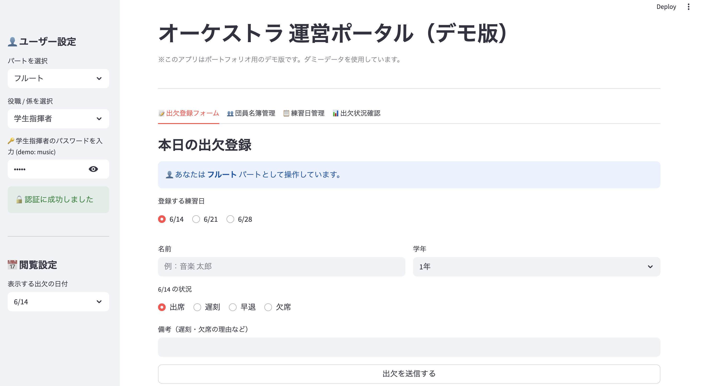
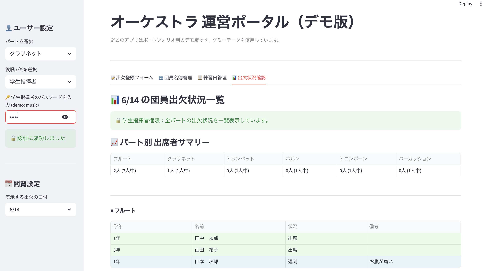
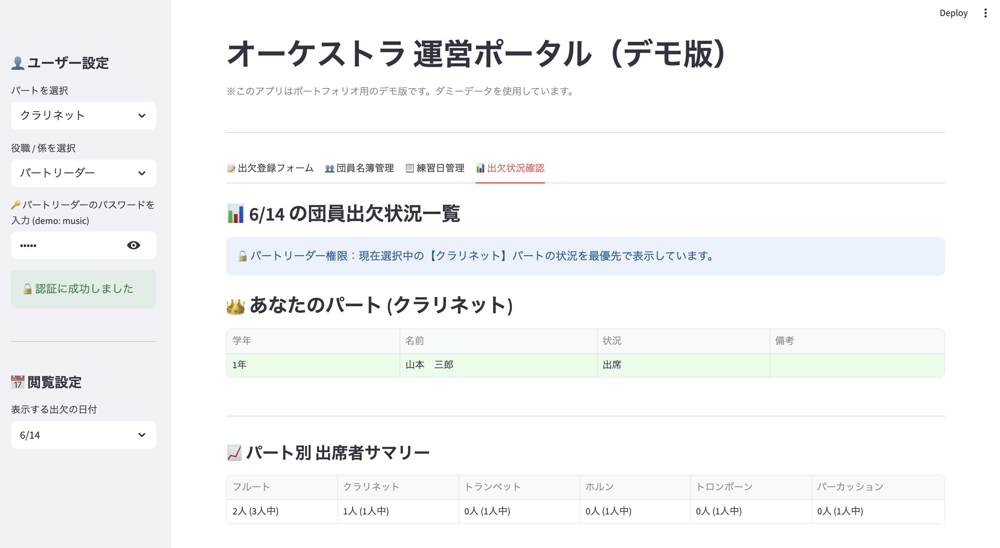
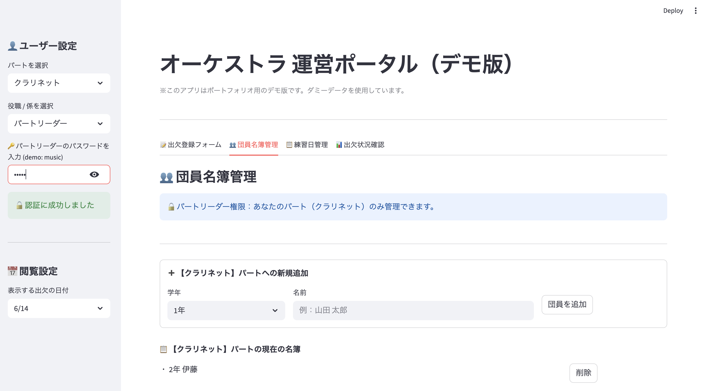

# 🎵 オーケストラ運営ポータル (Orchestra Management Portal)

音楽団体（オーケストラ・吹奏楽団）における、出欠管理および名簿管理の課題を解決するために開発したWebアプリケーションです。

アナログな連絡や集計による運営の手間を削減し、団員・パートリーダー・幹部それぞれの目線に合わせた最適なUI/UXを提供することで、組織全体のDX（デジタルトランスフォーメーション）を推進することを目的としています。

※ 本リポジトリはポートフォリオ用のデモ版であり、個人情報保護のため全て架空のダミーデータを使用して動作します。

## 💡 開発の背景と解決した課題

数十人規模の音楽団体では、練習ごとの出欠確認や名簿管理がスプレッドシートやチャットツールで属人的に行われており、「合奏に必要なパートが揃っているか」を瞬時に把握しづらいという課題がありました。
本システムは、これらの情報を一元管理し、直感的なダッシュボードとして可視化することで、運営の意思決定をスムーズにします。

## ✨ 主な機能と工夫した点 (Features)

本システムは、実際の運用を想定し、単なる入力フォームではなく**「権限に応じた情報制御（RBAC）」**と**「データの連動」**にこだわって設計しています。

## ✨ 主な機能とこだわり (Features)

本システムは、実際の運用プロセスを想定し、**「権限に応じた情報制御（RBAC）」**と**「データの連動」**にこだわって設計しています。

### 1. 👤 ロールベースのアクセス制御 (RBAC) とUI/UX
ユーザーの役職（一般団員、パートリーダー、幹部など）に応じて、閲覧・操作できる画面を動的に切り替えます。
* **一般団員:** 自身の出欠登録と、自パートの状況のみ閲覧可能（不要な情報ノイズの削減）。
* **パートリーダー:** 自パートの名簿管理と、他パートを含めた状況確認が可能。
* **幹部・学生指揮者:** パスワード認証を経て、全パートのマスターデータ（名簿・練習日）の管理が可能。

### 2. 👥 名簿マスターデータと出欠状況の動的連動
「団員名簿管理」タブで登録された人数（分母）と、「出欠登録」タブで送信された出欠データ（分子）を内部で連携させています。これにより、ダッシュボード上に「〇人中〇人が出席」というサマリーがリアルタイムで自動集計されます。

### 3. 📊 視認性の高いダッシュボード (データ可視化)
* **カラーユニバーサルデザイン:** 出席（緑）、遅刻（青）、早退（黄）、欠席（赤）と状況に応じて表の行全体を色分けし、直感的な把握を可能にしました。
* **多重ソート機能:** データを「状況順（出席→欠席）」に並び替えた後、さらに「学年順（1年→3年）」で自動ソート（Pandasを活用）することで、どのパートに誰が不足しているかを瞬時に見分けることができます。

## 📸 画面イメージ (Screenshots)

### 1. 出欠登録フォーム

自身のパートや学年を選択し、指定された練習日に対する出欠を送信します。自分がどのパートとして操作しているかが常に明示されるフールプルーフ設計です。

### 2. 出欠状況確認（ダッシュボード）
**▼ 学生指揮者・幹部ビュー（全パート一覧）**


**▼ パートリーダービュー（自パート優先表示）**


役職に応じて表示内容が変化します。色分けとソートにより、合奏の成立可否が一目でわかります。

### 3. 団員名簿管理（マスターデータ管理）

権限を持つユーザーのみがアクセスでき、ここで追加・削除されたメンバー情報が、出欠ダッシュボードの計算ベース（分母）として即座に反映されます。

## 🛠 使用技術 (Tech Stack)

* **言語:** Python 3.x
* **フレームワーク:** Streamlit (フロントエンド構築・状態管理)
* **データ処理:** Pandas (データフレーム操作、多重ソート、集計)
* **標準ライブラリ:** datetime (直近の練習日の自動計算)

## 🚀 環境構築と実行方法 (How to Run)

ローカル環境でこのアプリケーションを実行する手順です。

1. **リポジトリのクローン**
   ```bash
   git clone [https://github.com/mokumoku1227/orchestra-portal](https://github.com/mokumoku1227/orchestra-portal)
   cd orchestra-portal
   ```

2. **必要なライブラリのインストール**
   ```bash
   pip install streamlit pandas
   ```

3. **アプリケーションの起動**
   ```bash
   streamlit run app.py
   ```

## 🔐 セキュリティとプライバシーについて
本アプリケーションはポートフォリオ用のデモ環境を想定しているため、データベースへの永続化は行わず st.session_state を用いたインメモリ動作となっています（ブラウザをリロードすると初期データに戻ります）。
